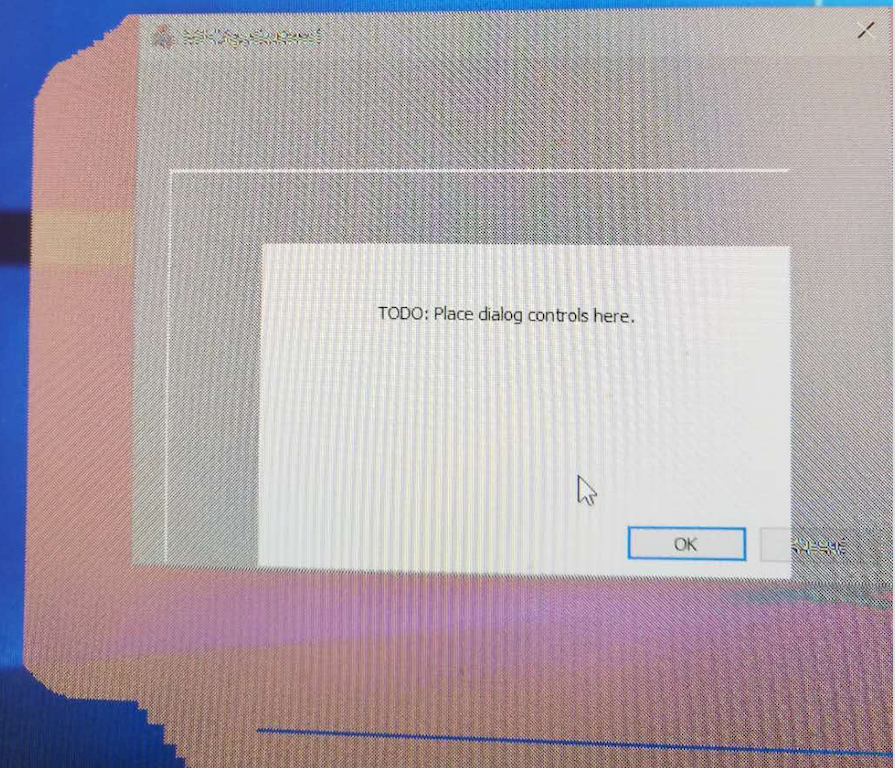

# mfc-draw-drag-rect-issue
A simple MFC app to reproduce MFC CDC::DrawDragRect() issue on Win10, version 1709, build 16299.64.
It is also reported by other guys in MSDN forum. See: [Why it have refresh problem when resize CDockablePane of Visual Studio 2012 in newest W10 system? Related to class CPaneDivider?](https://social.msdn.microsoft.com/Forums/vstudio/en-US/3ef9bb59-04ac-47a1-8f8f-29204bced7f4/why-it-have-refresh-problem-when-resize-cdockablepane-of-visual-studio-2012-in-newest-w10-system?forum=vcgeneral#3ef9bb59-04ac-47a1-8f8f-29204bced7f4)

## The App
The app is very simple, most of codes are generated by standard dialog based MFC project template provided by Visual Studio 2017. The only changes are in [MFCApplication1/MFCApplication1Dlg.cpp](MFCApplication1/MFCApplication1Dlg.cpp) where I add three event handlers to draw drag rectangle during the mouse down/move/up by using 
MFC's `CDC::DrawDragRect()`.

## Reproduce steps
1. Download the compiled executable file [here](releases/download/v1.0/MFCApplication1.exe). (you can also compile it by yourself, see How to compile section)
1. Launch the executable on Win10 version 1709.
1. Click the dialog and drag (not the title bar). You will see lots of unexpected "rectangles" while dragging, like this:

**Since The app works fine on Win10 prior to version 1709, I believe this is a regression caused by OS upgrade!**

## How to Compile
1. Open the visual studio solution file, MFCApplication1.sln with Visual Studio 2017.
1. Compile the solution.

